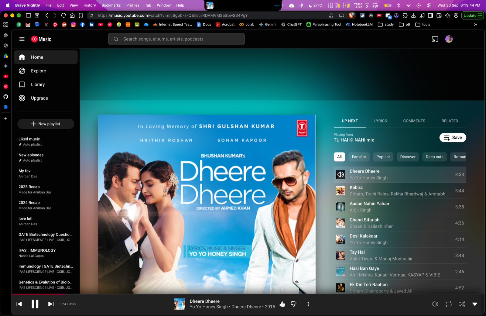

<div align="center">


# Ambient Light for YouTube Music™

An immersive, real-time Ambilight glow extension built specifically for **[YouTube Music](https://music.youtube.com)** (`music.youtube.com`).

[](LICENSE)
[](manifest.json)
[](manifest.firefox-v2.json)
[](#-installation-guide)

<br/>



</div>

---

## ✨ Features

- 🎨 **Dual-Mode Ambient Light Engine**:
  - **Video Mode**: Real-time edge color sampling and ambient light projection for music videos playing on YouTube Music.
  - **Album Cover Mode**: Rich diffused ambient aura extracted directly from the active track's high-resolution album cover, with butter-smooth cross-fading when tracks change.
- ⚡ **Ultra-Efficient Performance**:
  - Hardware-accelerated CSS filters with an offscreen downsampling canvas (64×36 internal buffer, < 0.1ms render budget).
  - Selectable frame rates (**15 FPS, 30 FPS, 60 FPS**) to preserve laptop battery and GPU cycles.
  - Automatically pauses render loops when playback is paused or tab is hidden.
- 🎛️ **Style Presets & Deep Customization**:
  - **Vibrant**: Rich, punchy colors and glowing saturation.
  - **Cinematic**: Expansive, atmospheric backlight for full immersion.
  - **Subtle**: Gentle, soft halo that doesn't distract.
  - **Monochrome**: Elegant silver/desaturated aura.
  - **Custom Sliders**: Fine-tune blur (20px – 140px), spread (105% – 145%), brightness, and saturation.
- 🎵 **Beat-Synced Audio Reactivity (Bass Pulse)**:
  - Optional Web Audio API frequency analysis that pulses the ambient halo to the rhythm of bass drops and sub-bass beats.
  - Configurable pulse sensitivity slider with automatic smoothing.
- ⌨️ **Instant Keyboard Shortcut with On-Screen HUD**:
  - Press <kbd>Alt</kbd> + <kbd>A</kbd> (or <kbd>Option</kbd> + <kbd>A</kbd> on macOS) to instantly toggle Ambilight on/off.
  - Sleek translucent HUD badge indicates the current status on screen.
  - Configurable in Chromium via `chrome://extensions/shortcuts`.
- 📱 **Responsive & Dynamic**:
  - Uses `ResizeObserver` to instantly adapt to theater mode, sidebars (queue, lyrics, related), and native fullscreen (`F`).
- 🌐 **Cross-Browser & Universal**:
  - Works on Chromium (Chrome, Brave, Edge, Opera, Arc), Firefox & Gecko forks, and WebKit (Safari, Orion).
  - Cross-platform storage fallbacks (`chrome.storage.sync` with `local` fallback).

---

## 📂 Project Structure

```text
ytmusic-ambilight/
├── .github/
│   └── ISSUE_TEMPLATE/       # Bug report & feature request templates
├── assets/
│   ├── icon.png              # Hi-res extension branding icon
│   └── preview.png           # Showcase screenshot for README and docs
├── dist/
│   ├── ytmusic-ambilight.zip     # Packaged Chromium extension (MV3)
│   ├── ytmusic-ambilight.xpi     # Packaged Firefox add-on (MV3/MV2)
│   └── ytmusic-ambilight.user.js # Standalone Userscript for Safari / Tampermonkey
├── icons/                    # Extension icons in standard sizes (16, 48, 128)
├── scripts/
│   └── build.py              # Automated build & packaging script
├── background.js             # Service worker handling global command shortcuts
├── content.css               # Hardware-accelerated styling, pulse effects & HUD toast
├── content.js                # Core Ambilight canvas sampler, audio analyser & hotkeys
├── LICENSE                   # MIT License
├── manifest.json             # Manifest V3 (Chrome, Brave, Edge, Firefox)
├── manifest.firefox-v2.json  # Manifest V2 fallback (Firefox ESR / legacy engines)
├── package.json              # NPM build & lint scripts
├── popup.html                # Settings popup interface with presets & audio toggles
├── popup.js                  # Settings controller & live sync
└── README.md                 # Project documentation
```

---

## 🚀 Installation Guide

### 🌐 1. Google Chrome, Brave, Microsoft Edge, Arc, Opera

#### Option A: Load Unpacked (Recommended for development)
1. Open your browser's extension settings page:
   - **Chrome**: `chrome://extensions`
   - **Brave**: `brave://extensions`
   - **Edge**: `edge://extensions`
2. Enable **Developer mode** (toggle in the top-right corner).
3. Click **Load unpacked** in the top-left toolbar.
4. Select the `ytmusic-ambilight` repository root folder.
5. Navigate to [music.youtube.com](https://music.youtube.com) and start playing music!

#### Option B: Packaged ZIP
1. Grab `dist/ytmusic-ambilight.zip` from this repository or from the [Releases](https://github.com/dasavra2002/ytmusic-ambilight/releases).
2. Unzip it and click **Load unpacked** on the extracted folder.

---

### 🦊 2. Mozilla Firefox, LibreWolf, Waterfox, Floorp

1. Open Firefox and type `about:debugging` in the address bar.
2. Click **This Firefox** in the left sidebar.
3. In the **Temporary Extensions** section, click **Load Temporary Add-on...**.
4. Select `manifest.json` (or `dist/ytmusic-ambilight.xpi`).
5. Open [music.youtube.com](https://music.youtube.com).

*(Note: For older Firefox ESR versions requiring Manifest V2, a dedicated `manifest.firefox-v2.json` is included).*

---

### 🧭 3. Apple Safari (macOS) & Orion

#### Orion (Native WebKit Browser for Mac)
Orion supports Chrome/Firefox extensions natively:
1. Open Orion, press `Cmd + ,` (Preferences) → **Extensions**.
2. Click **Install from disk** and choose the `ytmusic-ambilight` folder.

#### Apple Safari (via Userscripts Extension)
1. Install the free, open-source [Userscripts Safari Extension](https://apps.apple.com/app/userscripts/id1463298887) (or Tampermonkey).
2. Add the packaged userscript: [`dist/ytmusic-ambilight.user.js`](dist/ytmusic-ambilight.user.js).
3. Navigate to [music.youtube.com](https://music.youtube.com).

*(Note: You can also compile a native Safari App Extension with full Xcode: `xcrun safari-web-extension-converter /path/to/ytmusic-ambilight`).*

---

## ⌨️ Keyboard Shortcuts

| Shortcut | Action | Scope |
| :--- | :--- | :--- |
| <kbd>Alt</kbd> + <kbd>A</kbd> *(or <kbd>Option</kbd>+<kbd>A</kbd> on Mac)* | Toggle Ambilight On / Off | In-page & global (configurable via browser shortcuts) |

---

## 🛠️ Development & Building

### Prerequisites
- Python 3.8+ (for packaging)
- Node.js 18+ (optional, for linting)

### Build Distribution Packages
Run the automated build script to bundle `dist/ytmusic-ambilight.zip`, `dist/ytmusic-ambilight.xpi`, and compile `dist/ytmusic-ambilight.user.js`:

```bash
# Using Python directly:
python3 scripts/build.py

# Or via npm:
npm run build
```

### Lint JavaScript Code
```bash
npm run lint
```

---

## 🤝 Contributing

Contributions, bug reports, and suggestions are welcome!

1. Fork the repository.
2. Create your feature branch (`git checkout -b feature/amazing-feature`).
3. Commit your changes (`git commit -m "Add some amazing feature"`).
4. Push to the branch (`git push origin feature/amazing-feature`).
5. Open a Pull Request.

If you encounter any issues, please submit a report using the [Bug Report Template](https://github.com/dasavra2002/ytmusic-ambilight/issues/new?template=bug_report.md).

---

## 📄 License

This project is licensed under the MIT License - see the [LICENSE](LICENSE) file for details.

---

<div align="center">
Made with ❤️ for music lovers. Not affiliated with Google LLC or YouTube Music™.
</div>
